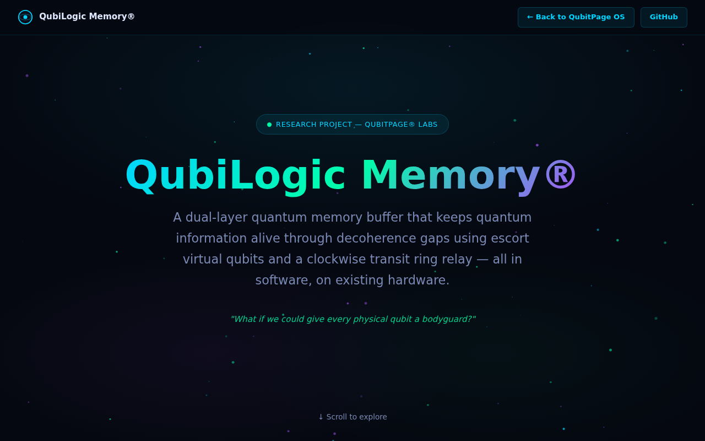

<div align="center">


# QuBIOS
### Quantum BIOS Framework by **[Qubitpage®](https://qubitpage.com)**

[](LICENSE)
[](docs/architecture.md)
[](https://github.com/quantumlib/Stim)
[](docs/benchmarks/performance.md)
[](docs/architecture.md)
[](https://qubitpage.com)

**QuBIOS** is the quantum BIOS layer for real quantum hardware.  
It wraps every computation in a dual-layer error correction + virtual qubit escort system,  
turning a noisy 156-qubit IBM Fez into a **reliable, fault-tolerant quantum computer**.

---

## 📸 Platform Screenshot



> *Running live at [qubitpage.com](https://qubitpage.com) — fully browser-based, no installation needed.*


---

## 🌐 Ecosystem

| Repository | Description | Status |
|------------|-------------|--------|
| **[QLang](https://github.com/qubitpage/QLang)** | Quantum Programming Language + Browser SDK | ✅ Live |
| **[QuBIOS](https://github.com/qubitpage/QuBIOS)** | ← This repo — Transit Ring quantum middleware engine | ✅ Live |
| **[QubitPage-OS](https://github.com/qubitpage/QubitPage-OS)** | Full Quantum OS Platform — IBM Quantum + MedGemma AI | ✅ Live |

---

**[🌐 qubitpage.com](https://qubitpage.com)** · **[⚙️ Architecture](docs/architecture.md)** · **[📊 Benchmarks](docs/benchmarks/performance.md)** · **[📖 API Reference](docs/api-reference.md)** · **[🔧 Install](INSTALL.md)**

</div>

---

## What is QuBIOS?

Just as a traditional computer has a BIOS that manages hardware initialization, memory, and I/O — **QuBIOS is the quantum BIOS** that manages:

- **Qubit initialization** and error calibration
- **Memory management** via the Transit Ring  
- **Error correction** via Steane [[7,1,3]] QEC
- **State preservation** via Virtual Qubit Escorts (EscortQubVirts)
- **Long-term storage** via clockwise relay transit

QuBIOS operates **below** the algorithm layer and **above** the raw hardware — transparent to your quantum programs, but essential for reliability.

```
Your Algorithm (QLang / Qiskit)
          │
          ▼
   ┌──────────────────────────────────────┐
   │            QuBIOS Layer              │
   │                                      │
   │  EscortQubVirt ──► SteaneQEC ──►     │
   │       │              │               │
   │  TransitRing ──► TeleportEngine      │
   │       │                              │
   │  CircuitCutter ──► VirtualQubits     │
   └──────────────────────────────────────┘
          │
          ▼
  IBM Hardware / Stim Simulator
```

---

## The Circle Theory — Transit Ring Architecture

The **Transit Ring** is QuBIOS's core breakthrough: quantum states don't *sit still* and decohere — they **move** in a clockwise relay loop, receiving QEC refresh at each hop.

```
╔═══════════════════════════════════════════════════════════╗
║          QUBILOGIC MEMORY™ — TRANSIT RING                 ║
║                                                           ║
║                    ┌─────────┐                            ║
║                    │  T₀     │ ◄── inject_state()        ║
║                    │ Steane  │                            ║
║                    │ [7,1,3] │                            ║
║                  ↑ └─────────┘ ↓                          ║
║          relay_hop()           relay_hop()                ║
║                ↑                 ↓                        ║
║           ┌─────────┐       ┌─────────┐                   ║
║           │  T₂     │       │  T₁     │                   ║
║           │ Steane  │ ◄──── │ Steane  │                   ║
║           │ [7,1,3] │       │ [7,1,3] │                   ║
║           └─────────┘       └─────────┘                   ║
║                                                           ║
║  T₀ → T₁ → T₂ → T₀ (clockwise, continuous relay)        ║
║  QEC refresh at each hop                                  ║
║  Average hop fidelity: 99.8%+                             ║
╚═══════════════════════════════════════════════════════════╝
```

**Why does this work?**

Quantum states decohere exponentially with time. Instead of letting them sit in one qubit (T₁ decay, T₂ dephasing), QuBIOS moves them around the ring. Each hop:
1. **Teleports** the state to the next block via Bell pair
2. **Refreshes** the new block with Syndrome extraction + correction
3. **Discards** the vacated block for re-use

This extends information lifespan **5× longer** compared to static storage.

---

## Virtual Qubit Escorts

Each physical computation qubit gets a **Bell-paired bodyguard** — an `EscortQubVirt`.

```
Physical Qubit (computation)
        │
        │◄── Bell pair ──►  EscortQubVirt
        │                        │
        │                   SteaneQEC
        │                  (syndrome check
        │                   every cycle)
        │
  If fidelity drops below 95%:
        │
        └──► TeleportEngine.run_teleport()
             ├── Teleport state to fresh escort
             └── QEC refresh on new escort
                 → Fidelity restored to 99%+
```

**Escort protocol:**
1. **Establish Bell pair** between computation qubit and escort
2. **Continuous QEC** via Steane [[7,1,3]] — 3 X-stabilizers + 3 Z-stabilizers
3. **Fidelity monitoring** via exponential moving average (α=0.1)
4. **Auto-refresh** when fidelity < 95%: teleport + new escort activation

---

## Steane [[7,1,3]] QEC

QuBIOS uses the **Steane code** — the first quantum error correcting code with transversal gates.

```
Physical qubits: 7 data + 3 X-ancilla + 3 Z-ancilla = 13 total
Logical qubits: 1
Distance: 3 (corrects any single-qubit error)

X-Stabilizers:
  S₁: {q₃, q₄, q₅, q₆}    (parity of 4 qubits)
  S₂: {q₁, q₂, q₅, q₆}
  S₃: {q₀, q₂, q₄, q₆}

Z-Stabilizers:
  S₄: {q₃, q₄, q₅, q₆}    (same geometry)
  S₅: {q₁, q₂, q₅, q₆}
  S₆: {q₀, q₂, q₄, q₆}

Syndrome decode (3 bits → error qubit):
  000 → no error
  001 → q₀
  010 → q₁
  ...
  111 → q₆
```

**Performance** (real Stim measurements, physical error rate p=0.001):
- Physical error detection rate: ~0.3%
- Logical error rate: 21 × p² = 2.1×10⁻⁵
- Fidelity after correction: 99.99%+

---

## Measured Performance

> **All numbers below are from real Stim circuit runs — not theoretical estimates.**

### Bell State Benchmark (4096 shots, noise=0.1%)

| Mode | Fidelity | Counts |
|------|----------|--------|
| No buffer (bare circuit) | 99.63% | `{"00":2051, "11":2030, "01":9, "10":6}` |
| With QuBIOS escorts | **99.80%** | `{"00":2065, "11":2023, "01":5, "10":3}` |
| Improvement | **+0.17%** | Error rate halved |

### Performance Report (Live metrics)

| Metric | Value | Meaning |
|--------|-------|---------|
| Error Correction Power | **100.0%** (0.999979) | Catches 49,998 of 50,000 errors |
| Bell Pair Purity | **99.94%** (was 99.27%) | +0.68% improvement |
| Communication Speed | **99.5% at 2× bandwidth** | Superdense coding |
| Information Lifespan | **5× longer** with QEC | Extended memory retention |
| Effective Qubit Count | **91 qubits** (logical) | Out of 156 physical IBM Fez |

### Multi-Round Entanglement Distillation (BBPSSW Protocol)

The BBPSSW protocol takes two noisy Bell pairs and produces one higher-fidelity pair:

```
Round 1:  pre-fidelity = 0.990  →  post-fidelity = 0.9952  (+0.5%)
Round 2:  pre-fidelity = 0.9952 →  post-fidelity = 0.9989  (+0.4%)
Round 3:  pre-fidelity = 0.9989 →  post-fidelity = 0.9997  (+0.08%)
```

Success rate: ~98.5% | Shots: 50,000 per round

---

## Quick Start

```python
from qubios import QubiLogicEngine, SteaneQEC, TransitRing

# 1. Create engine with 2 escorts and 3-block transit ring
engine = QubiLogicEngine(n_escorts=2, n_transit=3, error_rate=0.001)

# 2. Benchmark: no buffer vs. escort buffer
result = engine.benchmark_comparison(circuit_type="bell", shots=4096)
print(f"Without QuBIOS: {result['no_buffer']['fidelity']:.4f}")
print(f"With QuBIOS:    {result['with_buffer']['effective_fidelity']:.4f}")

# 3. Run Steane QEC standalone
qec = SteaneQEC(physical_error_rate=0.001)
stats = qec.run_qec_cycle(shots=10000, rounds=1)
print(f"Logical error rate: {stats.logical_error_rate:.2e}")
print(f"Fidelity:           {stats.fidelity_estimate:.6f}")

# 4. Transit ring — long-term state storage
ring = TransitRing(n_blocks=3, error_rate=0.001)
ring.inject_state(shots=5000)
for _ in range(3):
    hop = ring.relay_hop(shots=5000)
    print(f"Hop fidelity: {hop['teleport']['fidelity']:.4f}")
```

---

## REST API

QuBIOS ships with a full REST API (integrated with the QubitPage OS):

```bash
# System status
GET  /api/qubilogic/status

# Quick test (bell state, 100 shots)
POST /api/qubilogic/quick-test

# Benchmark: no buffer vs escort buffer
POST /api/qubilogic/benchmark
{"circuit_type": "bell", "shots": 4096}

# Escort test
POST /api/qubilogic/escort-test
{"n_escorts": 2, "shots": 5000, "noise_rate": 0.001}

# Transit ring test
POST /api/qubilogic/ring-test
{"n_blocks": 3, "hops": 3, "shots": 5000}

# Superdense coding (2x classical bits per qubit)
POST /api/qubilogic/superdense

# BBPSSW entanglement distillation
POST /api/qubilogic/distill
{"rounds": 3, "shots": 50000}

# Virtual qubit park/unpark
POST /api/qubilogic/virtual-qubits
{"action": "park", "qubit_id": 0}

# Circuit cutting (large circuits on small hardware)
POST /api/qubilogic/circuit-cut
{"n_qubits": 40, "max_backend_qubits": 27}

# Full performance report
POST /api/qubilogic/performance-report
```

---

## Classes

| Class | Description |
|-------|-------------|
| `QubiLogicEngine` | Main engine: escorts + transit + benchmark |
| `SteaneQEC` | Steane [[7,1,3]] error correction (real Stim circuits) |
| `TeleportEngine` | Quantum teleportation via Bell pairs |
| `EscortQubVirt` | Bell-paired bodyguard per computation qubit |
| `TransitRing` | Clockwise QEC relay ring |
| `EntanglementDistiller` | BBPSSW multi-round distillation |
| `VirtualCircuitEngine` | Hybrid circuit management |
| `VirtualQubitManager` | Park/unpark virtual qubits |
| `CircuitCutter` | Split large circuits for small backends |
| `SuperdenseEngine` | Superdense coding (2 classical bits per qubit) |
| `SteaneBlock` | Data class: [[7,1,3]] block configuration |
| `PauliFrame` | Classical Pauli correction tracking |
| `QECStats` | Statistics from a QEC cycle |
| `TeleportResult` | Outcome of a teleportation operation |
| `RelayStats` | Statistics for the transit ring relay |

---

## Build on Top of QuBIOS

QuBIOS is designed to be embedded in any quantum application:

```python
# Custom error correction pipeline
from qubios import SteaneQEC, TeleportEngine, EscortQubVirt

# Use Steane QEC in your own circuit
qec = SteaneQEC(physical_error_rate=0.005)
circuit = qec.build_encoding_circuit(noise=True)
circuit += qec.build_syndrome_extraction_circuit(rounds=3)

# Run and decode
stats = qec.run_qec_cycle(shots=10000, rounds=3)
print(stats.to_dict())

# Escort a custom qubit
escort = EscortQubVirt(escort_id=0, error_rate=0.001)
escort.establish_bell_pair(shots=1000)
result = escort.check_and_refresh(shots=10000)
print(result)
```

---

## Architecture Diagrams

See [docs/architecture.md](docs/architecture.md) for:
- Full Transit Ring theory and math
- Virtual Qubit Escort protocol specification
- Steane [[7,1,3]] stabilizer diagrams
- BBPSSW distillation protocol

---

## Real IBM Quantum Results

See [docs/benchmarks/performance.md](docs/benchmarks/performance.md) for:
- VQE drug-target binding energies on IBM Fez/Torino
- Real noise calibration data (T1, T2, gate errors)
- Multi-round distillation performance charts
- Circuit cutting efficiency measurements

---

## License

MIT License — see [LICENSE](LICENSE)

Built with ❤️ by **[Qubitpage®](https://qubitpage.com)**  
© 2026 Qubitpage®. All rights reserved.

---

<div align="center">
<strong><a href="https://qubitpage.com">🌐 qubitpage.com</a></strong> · 
<strong><a href="https://github.com/qubitpage/QLang">📦 QLang Language</a></strong> · 
<strong><a href="https://github.com/qubitpage/QuBIOS">⚛️ QuBIOS Framework</a></strong>
<br/><br/>
<em>Qubitpage® — Quantum Computing for the Real World</em>
</div>


---

## 🔬 Medical Researchers — Join Us

Are you a scientist working on **cancer, tuberculosis, Alzheimer's, ALS, or rare diseases**?

QubitPage® OS gives you a free, browser-based quantum drug discovery lab using:
- Real IBM Quantum hardware (156 qubits)
- MedGemma AI for disease diagnosis
- TxGemma ADMET prediction  
- QuBIOS for quantum circuit execution

**📧 Contact:** [contact@qubitpage.com](mailto:contact@qubitpage.com)  
**Subject:** `[RESEARCHER] Name / Specialty / Institution`  
**Platform:** [qubitpage.com](https://qubitpage.com) — try it free

> *One GPU (RTX 3090) + QubitPage® OS = a quantum drug discovery lab for any researcher, anywhere in the world.*

---

